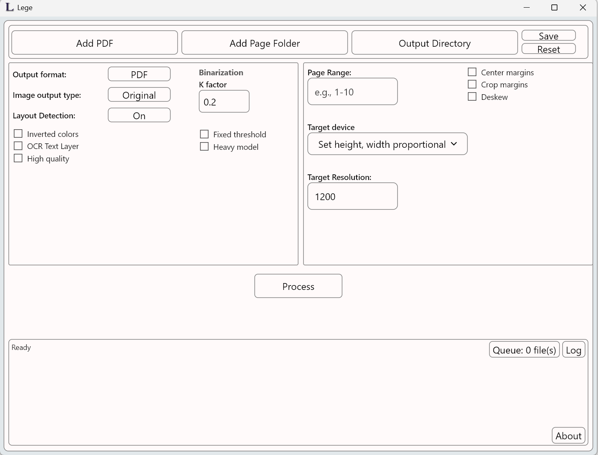

<div align="center">
  
  
</div>

# Lege - 1.4.0
Releases are updated with every new version --> https://github.com/LegeApp/Lege/releases/

**Turn scanned PDFs (or page-image folders) into clean, compact files that read great on e-ink.**

Lege is a document-processing app (CLI + desktop GUI) that converts scanned documents into reader-optimized **PDF** or **DjVu**, focusing on **better readability**, **smaller output size**, and **fast page turns** on e-ink devices. It uses layout-aware processing to treat *text-like* areas differently from *image-like* areas, so you can keep diagrams/photos while compressing text aggressively. 

---

## What you can do with it

* **Convert scanned PDFs → optimized PDF**

  * Mixed-content output (compressed text base + image overlays where needed).
* **Convert scanned PDFs → DjVu**

  * Very strong compression for compatible readers (especially e-ink + KOReader).
* **Optional searchable text (OCR)**

  * Linux/macOS: Tesseract backend
  * Windows: WinRT OCR backend 
* **Smart page cleanup**

  * Margin workflows (none / standardize-and-center / crop-and-resize)
  * Optional deskew / orientation correction
  * Device/target-size presets for common e-ink screens 

---

## Interfaces

* **CLI**: guided interactive mode (no args) + direct command modes
* **GUI**: Dioxus desktop app using the same processing core; queue-based workflow with progress + cancel

---

## Quick start

### Build (from source)

```bash
git clone https://github.com/LegeApp/Lege.git
cd Lege
cargo build --release
```

You’ll get:

* CLI: `target/release/lege`
* GUI (Dioxus): `target/release/lege-gui` (name may vary by workspace config) 

### Run

```bash
# simplest: optimized PDF output
lege input.pdf

# DjVu output (optionally with OCR)
lege input.pdf --output-format djvu --ocr

# process a page range
lege input.pdf --pages 10-50
```

the CLI also supports an interactive guided mode when run without arguments.

---

## Inputs and outputs

### Inputs

* **PDF files** (with optional page range selection)
* **Image-folder mode** for sequential page images (used for batch/page-image workflows)
* Debug modes for exporting rendered pages / crops (useful for model and pipeline inspection)

### Outputs

* **PDF**: mixed region encoding (compressed bi-level text + preserved image regions as overlays)
* **DjVu**: native Rust encoder with **JB2** (bi-level) + **IW44** (continuous-tone) layering

---

### External Dependencies

Lege requires several external files to be placed alongside the executables:

#### Required for all platforms:

**ONNX Models** (AI inference):
- `yolo-layout.onnx` - Layout detection (Linux production model)
- `paddle-layout.onnx` - Layout detection (legacy/non-Linux fallback)
- `paddle-rotate.onnx` - Page orientation detection
- `paddle-deskew.onnx` - Page deskew correction
- `sauvola.onnx` - Adaptive binarization

**Platform-specific GPU libraries:**

**Windows:**
- `DirectML.dll` - DirectML acceleration provider
- `onnxruntime.dll` - ONNX Runtime main library
- `onnxruntime_providers_shared.dll` - Shared provider library
- `pdfium.dll` - PDF rendering engine

**Linux:**
- `libonnxruntime.so` - ONNX Runtime
- `libonnxruntime_providers_shared.so` - Provider library
- `libwebgpu_dawn.so` - WebGPU/Vulkan backend
- `libpdfium.so` - PDF rendering engine
- `eng.traineddata` - Tesseract English language data (for OCR)

**macOS:**
- `libonnxruntime.dylib` - ONNX Runtime
- `libpdfium.dylib` - PDF rendering engine
- Tesseract language data (system installation)

# Technical details

## High-level pipeline

Lege is an end-to-end document transformation system with distinct pipelines for PDF and DjVu output.

### Core stages

1. **Render pages** (PDF → images) using PDFium (with thread-safety guardrails). 
2. **Layout inference** (optional): run an ONNX layout model on a low-res render; map detections into text-like vs image-like buckets.
3. **Region processing**

   * Text regions: binarize + encode with bi-level codecs
   * Image regions: preserve/encode separately; composite as overlays where applicable
   * Optional OCR integration at region or page level
4. **Assemble output**

   * PDF writer actor: ordered page finalize into a single PDF
   * DjVu writer actor: out-of-order page submission + multipage finalize

## PDF pipeline vs DjVu pipeline

### PDF pipeline (`src/pipeline/pdf_tokio_pipeline.rs`)

Implemented as a multi-stage async pipeline with bounded channels and configurable concurrency:

* render → inference → CPU page processing → ordered writer/finalizer
* supports page ranges and optional two-pass margin normalization 

### DjVu pipeline (`src/pipeline/djvu_pipeline.rs`)

Separate pipeline to match DjVu constraints:

* similar render/inference conceptually
* produces DjVu page payloads submitted to a DjVu writer actor
* supports layered JB2/IW44 output, and optional hidden text

## Layout detection

Lege can run layout detection to segment a page into regions and apply different encoding strategies. The exact classes depend on the model used (the existing README references a PaddleX-style detector).  

When layout detection is disabled, Lege follows a more uniform “whole-page” processing strategy. 

## Binarization and image treatment

* **Text-like regions** are typically converted to **1-bit** (bi-level) using adaptive binarization logic in the encoding layer.
* **Image-like regions** can be preserved/encoded separately and overlaid onto the output (so photos/diagrams don’t get crushed into 1-bit).

Dithering can be used for halftone/image handling depending on the chosen mode and encoder strategy.  

## OCR and text layers

OCR is optional:

* **Linux/macOS**: Tesseract
* **Windows**: WinRT OCR 

Strategy:

* prefer bounded region OCR when layout segmentation is workable
* fall back to tiled or full-page OCR as needed
* when OCR is disabled, Lege can optionally reuse/extract text from PDFs that already have a text layer to synthesize a text overlay where possible

## Encoding formats and where they’re used

Lege uses a dedicated encoding crate (`Legencode`) for in-memory processing and multiple output encoders, and a dedicated native DjVu encoder (`DJVULibRust`) for DjVu generation.

### Bi-level / “text compression” codecs

* **JBIG2** (via a Rust port under `Legencode`)
* **CCITT Group 4** (fax-style bi-level compression)  

### Continuous-tone codecs

* **JPEG** (used for cover/photo regions in common paths) 
* **DjVu IW44** (continuous-tone layer inside DjVu)  

## Performance and operability features

* **Concurrent pipeline** with bounded channels/backpressure
* **Cancellation + progress tracking** shared by CLI and GUI
* Runtime dependency discovery (models/libs) via executable-adjacent paths, env vars, and platform fallback dirs

---

## Workspace layout

Lege is a Rust workspace with multiple crates:

* `src/` — main app + pipeline orchestration (CLI core)
* `Legencode/` — encoding + binarization + region utilities
* `DJVULibRust/` — native DjVu encoder crate
* `GUI/Dioxus/` — desktop GUI frontend 

---

## Related Projects


## License

GPL-3.0. See `LICENSE`. Third-party licenses are documented under `docs/`. 

---


