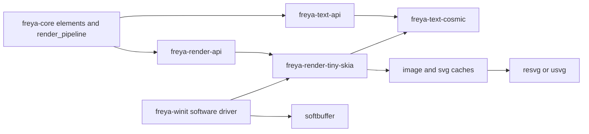
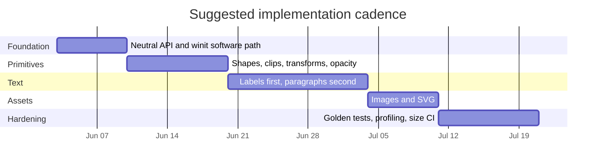

# Tiny Skia and Cosmic Text CPU Renderer Plan for Freya

## Executive summary

This port is feasible, but it is **not** a simple backend swap. In your rc.17 fork, Skia is not isolated behind a narrow renderer facade: `freya-engine` re-exports a large Skia-shaped API surface, including `Canvas`, `Surface`, text layout, SVG, image, matrix, and GPU modules; `freya-core::RenderContext` passes a raw `Canvas`; `label` and `paragraph` build and paint Skia paragraphs directly; `image` stores and draws `SkImage`; `svg` stores and renders a Skia `svg::Dom`; and `freya-winit` presents a Skia `Surface` through GL/Metal/Vulkan drivers. That means a production-quality CPU renderer needs a **backend-neutral rendering seam** for drawing, text, images, and SVG, rather than a `tiny-skia` compatibility shim pretending to be Skia. citeturn38view0turn39view3turn34view0turn36view7turn37view2turn36view6turn34view5turn32view1

The good news is that your target feature set is unusually favorable for a CPU path. `tiny-skia` already provides the right low-level primitives for a minimal installer UI: premultiplied RGBA pixmaps, rectangular/path filling, stroking, affine transforms, masks for clipping, gradients, and pixmap compositing. The project explicitly positions itself as a **minimal CPU-only 2D renderer** focused on rendering quality, speed, and binary size, and its public API is intentionally low-level, with transform and clipping state managed by the caller. That makes it a good fit for a Freya-owned state stack. citeturn28view0turn28view1turn41view0turn42view0turn42view1turn42view5turn42view6

For text, `cosmic-text` is also a good fit, but it is the hardest part of the port. Freya’s current text stack relies on paragraph layout, painting, range rect queries, and point-to-glyph hit testing. `cosmic-text` provides a `Buffer`-based layout model, shaping modes, and a `SwashCache` for glyph images, so it can cover labels, rich spans, selection highlights, and caret placement. The work is not in basic capability; it is in building a clean Freya adapter that preserves paragraph measurement and hit-testing semantics. citeturn15view0turn15view1turn15view2turn15view3turn15view4turn15view5turn29view0turn29view1turn37view3turn37view4

For presentation, `softbuffer` is the right default for a no-GPU desktop path. Its own docs describe it as a way to draw a software-rendered image straight to a window without depending on the GPU or hardware-accelerated graphics stack, and it supports the desktop windowing platforms that matter here, including AppKit, Win32, Wayland, XCB, and Xlib. One important implementation detail is that `softbuffer` presents a `u32` buffer in `0x00RRGGBB` form, while `tiny-skia` stores **premultiplied RGBA** pixels, so your CPU renderer must flatten/composite the final frame before copying into the presentation buffer. citeturn24view0turn25view1turn25view2turn25view3turn26view0turn41view0

There is also a very useful reference path upstream: current Freya `main` has added a `Software` graphics driver that can be selected with `FREYA_RENDERER=software`, and its implementation uses `softbuffer` plus a wrapped software pixel surface before calling `window.pre_present_notify()` and `buffer.present()`. That does **not** solve your main problem, because it still keeps Skia in the binary, but it is the best template for how to wire winit, redraw, resize, and presentation correctly in your fork. citeturn40view0turn40view2turn40view3

My recommendation is:

| Decision | Recommendation | Why |
|---|---|---|
| Renderer strategy | Add a **backend-neutral render command API** and implement a `tiny-skia` backend | The current Skia surface is too deeply leaked to replace safely with type aliases alone. citeturn38view0turn34view0turn32view1turn28view0 |
| Presentation | Use `softbuffer` in `freya-winit` | It is cross-platform, desktop-friendly, and explicitly CPU-only. citeturn24view0turn25view0turn25view1turn25view2 |
| Text | Introduce a `ParagraphLayout` abstraction backed by `cosmic-text` | Freya currently depends on measurement, range rects, paint, and hit-testing. citeturn36view7turn37view2turn37view3turn37view4turn15view0turn15view2turn15view3 |
| SVG | Use `usvg`/`resvg` and cache raster outputs | `resvg` already renders `usvg::Tree` into a tiny-skia pixmap. citeturn22view0turn23view0turn23view1turn23view2turn21search0 |
| Scope control | Defer generic post-process blur in v1 | The current Skia pipeline uses save-layers and blur filters; tiny-skia is intentionally lower-level. citeturn36view0turn36view1turn36view2turn36view3turn28view0 |

## Freya today and the architecture that fits this port

Freya rc.17 is currently organized around a Skia-shaped engine facade. `freya-engine` conditionally exports either a mocked backend or a Skia backend, and its `prelude` aliases Skia types like `Canvas`, `Surface`, `Paragraph`, `Path`, `Image`, `RRect`, `Rect`, `Matrix`, and many more into the rest of the workspace. In `freya-core`, `RenderContext` carries `font_collection`, `canvas`, `layout_node`, `text_style_state`, and `tree`. In `freya-winit`, `GraphicsDriver::present` still asks for a closure of type `FnOnce(&mut SkiaSurface)` and rc.17 only exposes OpenGL, Metal, and optionally Vulkan drivers. That combination is why the port should start by inserting a neutral renderer seam rather than trying to “teach tiny-skia to look like Skia.” citeturn38view0turn39view3turn34view0turn32view1

A second important detail is how Freya already uses the renderer. The core render pipeline clears the canvas, saves and restores state per node, applies clip elements, concatenates rotation matrices, applies inherited opacity through `save_layer_alpha_f`, applies scale transforms, and conditionally uses a blur backdrop and `save_layer` for blur effects. That is a retained-state rendering contract, not just a handful of immediate draw calls. Your CPU backend therefore needs its own state stack with transform, clip, and offscreen-layer management. citeturn35view0turn36view0turn36view1turn36view2turn36view3

The architecture I would add is shown below. The key design choice is that **Freya owns the rendering contract**, while `tiny-skia`, `cosmic-text`, `resvg`, and `softbuffer` remain implementation details.



The crate/module changes I recommend are these:

| Area | Change | Rationale |
|---|---|---|
| `crates/freya-render-api` | **Add** | Own small geometry, brush, clip, image, paragraph, and command traits here instead of leaking backend types through `freya-engine`. |
| `crates/freya-text-api` | **Add** | Keep paragraph measurement, hit testing, and painting abstractions separate from raster backend. |
| `crates/freya-render-tiny-skia` | **Add** | Implement CPU rasterization, clip masks, shadow blur, image compositing, and layer compositing on `tiny-skia::Pixmap`. |
| `crates/freya-text-cosmic` | **Add** | Implement `ParagraphLayout` and text measurement/rasterization using `cosmic-text` + `SwashCache`. |
| `crates/freya-core` | **Modify** | Replace raw `Canvas`/`SkParagraph` usage in render and text call sites with backend-neutral interfaces. |
| `crates/freya-winit` | **Modify** | Add a `SoftwareDriver` in rc.17, following upstream main’s softbuffer flow, but targeting the new CPU renderer rather than a Skia raster surface. citeturn40view0turn40view2 |
| `crates/freya-engine` | **Shrink or deprecate** | Keep it only as a legacy compatibility layer during migration; do not make it the long-term abstraction boundary. |

The most important architectural rule is simple: **do not port Skia concepts one-for-one unless they are genuinely part of Freya’s UI contract**. `tiny-skia` is explicitly low-level and requires the caller to manage transform, clipping mask, and style state manually, so the clean port is to codify Freya’s needs directly: fills, strokes, images, text, SVG, clipping, transforms, opacity layers, and a narrow shadow effect. citeturn28view0

## API mapping and the concrete renderer interfaces

The practical mapping from current Freya drawing to the proposed stack looks like this.

| Freya surface today | Current usage in rc.17 | Tiny-skia / cosmic-text / resvg mapping | Gap or note |
|---|---|---|---|
| Canvas clear and filled rects | `render_pipeline` clears the canvas; `rect`, `canvas`, `paragraph` highlights/cursors use `draw_rect` | `Pixmap::fill_rect` with a current transform and optional clip mask. citeturn35view0turn37view3turn41view0turn42view6 | Straightforward. |
| Paths, borders, custom rounded shapes | `rect` draws paths and borders; Skia border path or `draw_drrect` is used today. citeturn36view5 | `PathBuilder`, `fill_path`, `stroke_path`, `Stroke`. Existing Freya rounded/smoothed-corner path math can be ported into backend-neutral path builders. citeturn41view1turn41view0turn42view0 | No built-in Freya-style high-level canvas convenience; path generation remains your code. |
| Clip rect/rrect/path | `clip_rect` and `clip_rrect` are called from element clip hooks and the render pipeline. citeturn34view5turn36view1 | `Mask` plus `Mask::fill_path`, then pass the mask into `fill_rect`, `fill_path`, `stroke_path`, or `draw_pixmap`. citeturn41view3turn42view1turn41view0 | You must own clip-mask intersection logic. |
| Transforms | `translate`, `scale`, `concat`, and rotation matrix concatenation are used in pipeline and elements. citeturn34view5turn36view2turn36view0 | `tiny-skia::Transform` on every draw. citeturn28view0turn41view0 | Because state is manual, backend code should maintain a transform stack. |
| Opacity layers | Pipeline uses `save_layer_alpha_f` for inherited opacity. citeturn36view0 | Render subtree into temporary pixmap, then composite back with `draw_pixmap` and alpha/blend settings. citeturn42view5turn41view0 | Needs offscreen allocation and tighter bounds calculation. |
| Generic blur effect | Pipeline uses Skia blur/backdrop and `save_layer`. citeturn36view1turn36view3 | Treat as deferred. | This is the biggest semantic mismatch; do not put it in MVP. |
| Box/path shadows | `rect` uses `MaskFilter::blur` when rendering shadows. citeturn36view3turn36view5 | Raster shape alpha mask, run a small CPU blur, tint, composite. | Use a tiny separable blur helper; keep the API narrow to “box/path shadow,” not arbitrary image filters. |
| Images | `image` stores `SkImage` and renders via `draw_image_rect_with_sampling_options`. citeturn36view6 | Decode to RGBA and store as `Pixmap`; render with `draw_pixmap` and `PixmapPaint` quality/filter settings. citeturn42view5turn41view0 | Keep source bytes for lazy re-decode and cache invalidation. |
| SVG | `svg` parses a Skia DOM and calls `svg_dom.render(canvas)`. citeturn34view5 | `usvg::Tree::from_data` + `resvg::render(tree, transform, &mut pixmap)`. citeturn22view0turn23view0turn23view1turn23view2 | Runtime fill/stroke overrides are easier if you preprocess SVG bytes before parsing. |
| Labels | `label` uses `ParagraphBuilder`, `layout`, `longest_line`, `height`, and `paint`. citeturn36view7 | `cosmic-text::Buffer` for layout plus a Freya `ParagraphLayout` adapter that exposes size and paint. citeturn15view0turn15view1turn15view2turn29view0 | Ellipsis likely needs a Freya-side truncation pass. |
| Rich paragraphs, selection, caret | `paragraph` uses span styles, `get_rects_for_range`, `get_glyph_position_at_coordinate`, and paints selection/cursor rects around the paragraph. citeturn37view2turn37view3turn37view4 | `cosmic-text` shaping/layout for the paragraph, plus adapter methods `hit_test`, `rects_for_range`, and glyph rasterization via `SwashCache`. citeturn15view2turn15view3turn15view4turn15view5 | This is the highest-risk area after blur. |
| Canvas component | `freya-components::canvas` gives client code a `FnMut(&mut RenderContext)` and uses engine `Paint`, `PaintStyle`, `SkRect`, `ClipOp`. citeturn34view1 | Expose a neutral command sink in `RenderContext`. | Keep this subset small at first; otherwise it becomes a second backend port. |

The minimal concrete API I would put into the fork is below. This is intentionally small and immediate-mode, because it lets you migrate current `element.render(...)` code without first building a full retained display-list subsystem.

```rust
use std::{ops::Range, sync::Arc};

pub type ImageId = u64;
pub type SvgId = u64;

#[derive(Clone, Copy, Debug, PartialEq)]
pub struct Point {
    pub x: f32,
    pub y: f32,
}

#[derive(Clone, Copy, Debug, PartialEq)]
pub struct Rect {
    pub left: f32,
    pub top: f32,
    pub right: f32,
    pub bottom: f32,
}

#[derive(Clone, Copy, Debug, PartialEq)]
pub struct Radius {
    pub x: f32,
    pub y: f32,
}

#[derive(Clone, Copy, Debug, PartialEq)]
pub struct RRect {
    pub rect: Rect,
    pub tl: Radius,
    pub tr: Radius,
    pub br: Radius,
    pub bl: Radius,
}

#[derive(Clone, Copy, Debug, PartialEq)]
pub struct Affine2D(pub [f32; 6]); // sx, kx, ky, sy, tx, ty

#[derive(Clone, Copy, Debug, PartialEq)]
pub struct Color {
    pub r: u8,
    pub g: u8,
    pub b: u8,
    pub a: u8,
}

#[derive(Clone, Debug)]
pub enum Brush {
    Solid(Color),
    Linear(LinearGradient),
    Radial(RadialGradient),
    Sweep(SweepGradient),
}

#[derive(Clone, Copy, Debug)]
pub enum FillRule {
    NonZero,
    EvenOdd,
}

#[derive(Clone, Copy, Debug)]
pub enum LineCap {
    Butt,
    Round,
    Square,
}

#[derive(Clone, Copy, Debug)]
pub enum LineJoin {
    Miter,
    Round,
    Bevel,
}

#[derive(Clone, Debug)]
pub struct StrokeStyle {
    pub width: f32,
    pub miter_limit: f32,
    pub line_cap: LineCap,
    pub line_join: LineJoin,
    pub dash: Option<Vec<f32>>,
}

#[derive(Clone, Debug)]
pub enum ClipShape {
    Rect(Rect),
    RRect(RRect),
    Path(PathData),
}

#[derive(Clone, Debug)]
pub struct PaintStyle {
    pub brush: Brush,
    pub anti_alias: bool,
}

#[derive(Clone, Debug)]
pub struct ImageDrawOptions {
    pub src: Option<Rect>,
    pub opacity: f32,
    pub sampling: ImageSampling,
}

#[derive(Clone, Copy, Debug)]
pub enum ImageSampling {
    Nearest,
    Bilinear,
    Trilinear,
    Mitchell,
    CatmullRom,
}

#[derive(Clone, Debug)]
pub struct SvgDrawOptions {
    pub opacity: f32,
}

#[derive(Clone, Debug)]
pub struct PathData {
    pub verbs: Arc<[PathVerb]>,
}

#[derive(Clone, Debug)]
pub enum PathVerb {
    MoveTo(Point),
    LineTo(Point),
    QuadTo(Point, Point),
    CubicTo(Point, Point, Point),
    Close,
}

pub trait ParagraphLayout: Send + Sync {
    fn size(&self) -> (f32, f32);
    fn hit_test_point(&self, point: Point) -> usize;
    fn rects_for_range(&self, range: Range<usize>) -> Vec<Rect>;
    fn line_count(&self) -> usize;
    fn draw(&self, renderer: &mut dyn TextRasterTarget, origin: Point);
}

pub trait TextRasterTarget {
    fn draw_alpha_mask(
        &mut self,
        mask: GlyphMaskRef<'_>,
        origin: Point,
        color: Color,
        clip: Option<&ClipShape>,
    );
    fn draw_color_bitmap(
        &mut self,
        bitmap: GlyphBitmapRef<'_>,
        origin: Point,
        clip: Option<&ClipShape>,
    );
}

pub trait RenderCommands {
    fn save(&mut self) -> usize;
    fn restore_to(&mut self, token: usize);

    fn clear(&mut self, color: Color);

    fn transform(&mut self, affine: Affine2D);
    fn clip(&mut self, shape: &ClipShape, anti_alias: bool);

    fn push_opacity_layer(&mut self, bounds: Rect, opacity: f32);

    fn fill_path(&mut self, path: &PathData, fill_rule: FillRule, paint: &PaintStyle);
    fn stroke_path(&mut self, path: &PathData, stroke: &StrokeStyle, paint: &PaintStyle);

    fn draw_image(&mut self, image: ImageId, dest: Rect, options: &ImageDrawOptions);
    fn draw_svg(&mut self, svg: SvgId, dest: Rect, options: &SvgDrawOptions);
    fn draw_paragraph(&mut self, paragraph: &dyn ParagraphLayout, origin: Point);
}

pub struct RenderResources<'a> {
    pub images: &'a mut dyn ImageStore,
    pub svgs: &'a mut dyn SvgStore,
    pub text: &'a mut dyn TextEngine,
}

pub struct RenderContext<'a> {
    pub cmds: &'a mut dyn RenderCommands,
    pub resources: &'a mut RenderResources<'a>,
    pub layout_node: &'a LayoutNode,
    pub text_style_state: &'a TextStyleState,
    pub tree: &'a Tree,
    pub scale_factor: f64,
}

pub struct LayoutContext<'a> {
    pub node_id: NodeId,
    pub area_size: &'a Size2D,
    pub text_style_state: &'a TextStyleState,
    pub fallback_fonts: &'a [std::borrow::Cow<'static, str>],
    pub text: &'a mut dyn TextEngine,
    pub text_cache: &'a mut TextCache,
    pub scale_factor: f64,
}
```

The important design choice in those signatures is that **text is not just another draw call**. Freya’s current paragraph code needs measurement, paint, range rects, and point hit-testing, so the text abstraction must be first-class rather than hidden behind a single `draw_text(...)` method. citeturn36view7turn37view3turn37view4

## Phased implementation plan

A realistic sequence for a minimal but production-usable port is below. The durations are approximate engineering estimates, not claims about upstream roadmaps.



| Phase | Main tasks | Effort | Main risk | Mitigation |
|---|---|---:|---|---|
| Foundation | Add `RenderCommands`, `ParagraphLayout`, resource traits; add `freya-winit` software driver using `softbuffer`; keep old Skia path compiling behind feature flags | Medium | Refactor churn across `freya-core` because `RenderContext` currently exposes raw Skia `Canvas` | Change the seam first, but keep a legacy Skia backend implementing the new traits so the tree keeps compiling while you port call sites incrementally |
| Primitives | Implement clear, save/restore, rect/path fill, stroke, clip, transform stack, opacity layers, rounded rect path helpers, borders | Medium | Nested clip + opacity interaction bugs | Golden tests with nested rounded clips and semi-transparent children; use tight layer bounds from existing render pipeline logic |
| Shadows | Add narrow CPU shadow module for box/path shadows only | Medium | Trying to replicate full Skia blur semantics explodes scope | Restrict v1 to shadows used by installer UI; explicitly defer generic `EffectData.blur` |
| Text labels | Implement `label` measurement and paint on `cosmic-text` | Medium | Layout mismatch around line height and ellipsis | Start with no ellipsis customizations except clip; add ellipsis once measurement is stable |
| Rich paragraphs | Implement span styling, selection rects, caret rects, and point hit-testing | High | This is the part most likely to break `input`, `selectable_text`, and editor-like components | Keep indices and paragraph queries behind `ParagraphLayout`; port `label` first, then `paragraph`, then editable widgets |
| Images | Replace `SkImage` ownership with decoded CPU image handles and cache | Low | Resize/sampling mismatch | Match today’s sampling modes one-for-one in DTOs and validate with image goldens |
| SVG | Replace Skia DOM path with `usvg`/`resvg` and raster cache | Medium | Runtime recolor overrides are less direct than Skia DOM mutation | Prefer static/pre-rasterized installer artwork in v1; if overrides are needed, preprocess XML before `usvg::Tree::from_data` |
| Hardening | Visual regression suite, perf counters, CI binary-size gates, documentation | Medium | Cross-platform font differences make goldens flaky | Bundle deterministic test fonts and lock goldens to those fonts |

The implementation sequence above is deliberately biased toward your stated use case. If the GUI is an installer-style shell, the fastest production path is to reach parity for **rects + labels + images + clipping + transform + opacity + box shadows** first, then decide whether `paragraph`, `svg`, and `Canvas` are needed in the initial shipping cut. The existing Freya core already uses more advanced Skia features for blur and some text/SVG behavior, but those are not necessary to get a good installer UI out the door. citeturn36view0turn36view1turn36view3turn37view2turn34view5

## Presentation, text, images, and SVG

For presentation, mirror upstream Freya main’s software-driver flow, but swap out the wrapped Skia raster surface for your `tiny-skia` frame pixmap. `softbuffer::Context::new(...)` takes a display handle, `Surface::new(...)` takes the window, `resize(...)` sets the CPU buffer size, `buffer_mut()` yields the frame buffer to write into, and `buffer.present()` displays it; upstream main also calls `window.pre_present_notify()` immediately before `present()`. This is the exact part of the upstream software driver that is worth reusing. citeturn25view0turn25view1turn25view2turn25view3turn40view2turn40view3

The one non-obvious step is pixel conversion. `tiny-skia::Pixmap` owns **premultiplied RGBA** pixels, while `softbuffer::Buffer` expects row-major `u32` pixels in `0x00RRGGBB` form. So the root renderer should always composite onto a known opaque background color in the `tiny-skia` pixmap, then convert the final frame into the `softbuffer` buffer. If you eventually want dirty-region optimization, `softbuffer` also exposes buffer age and damage-region presentation. citeturn41view0turn26view0

Platform-wise, `softbuffer` is a good match for your Windows/macOS/Linux target set. Its docs say it supports all major desktop platforms that winit uses on desktop, and it explicitly calls out AppKit, Wayland, Win32, XCB, and Xlib as supported. It also explains why it differs from `pixels`: `softbuffer` does **not** rely on the GPU or hardware-accelerated graphics stack. That makes it the right default for your “no GPU at all” requirement. citeturn24view0turn25view4

For text, I would use one long-lived `FontSystem` and one long-lived `SwashCache` per renderer thread, then create or reuse a `Buffer`-backed paragraph object per label/paragraph node. `cosmic-text` is positioned as pure-Rust multi-line text handling, and its published dependency graph includes `fontdb`, `harfrust`, `skrifa`, and optional `swash`, which lines up well with system font discovery, shaping, outline handling, and glyph rasterization. `Buffer` exposes methods for setting text and size and for iterating layout runs, while shaping modes include both `Basic` and `Advanced`; for a production installer UI, I would default to `Advanced` shaping and only add a fast path later if profiling shows a real need. `SwashCache` exposes glyph-image retrieval for painting. citeturn29view0turn29view1turn15view0turn15view1turn15view2turn15view3turn15view4turn15view5

Font fallback should stay close to Freya’s current model. `LayoutContext` already carries a `fallback_fonts` slice, and `cosmic-text` exposes CSS-like family categories such as `SansSerif`, `Serif`, `Monospace`, and `Name(...)`. So the clean adapter is: requested family list from Freya, followed by your fallback list, followed by a stable generic family, with a couple of bundled fonts only for regression tests and installer-critical branding elements. citeturn34view0turn20view0turn20view1

The main text fallbacks I would plan up front are these: a Freya-side ellipsis/truncation pass if your current UI uses `TextOverflow::Ellipsis`, a simple shadow policy for text shadows, and an explicit paragraph API for `rects_for_range` and `hit_test_point`. Freya’s current paragraph code depends directly on range rect queries and point hit testing to draw selection highlights and carets around the laid-out text, so those methods are part of your real contract even if your installer UI does not need full editing on day one. citeturn37view3turn37view4

For images, use the existing byte-oriented ownership style, but replace `SkImage` with a CPU image handle that stores the original bytes plus a cached decoded `Pixmap`. Current Freya image rendering maps nicely to `tiny-skia`: its pixmap API includes `draw_pixmap`, and `tiny-skia`’s image composition supports transform and filter quality through `PixmapPaint`. That is enough to preserve Freya’s current nearest/bilinear/cubic style DTOs behind a neutral enum. citeturn36view6turn42view5turn41view0

For SVG, the clean CPU path is `usvg` for parsing and normalization and `resvg` for rasterization. `usvg::Tree::from_data(...)` parses SVG bytes, `Options` provides `resources_dir` plus a font database and related settings, and `resvg::render(...)` renders a tree onto a tiny-skia pixmap. `resvg` also documents a deliberately pure-Rust, low-bloat design, plus reproducible rendering across platforms, which is exactly what you want for regression testing. My recommendation is to cache the rasterized output by `(svg hash, target width, target height, scale factor, override style hash)` and to **prefer pre-rasterizing** installer assets if your SVG use is primarily icons or branding marks. citeturn22view0turn23view0turn23view1turn23view2turn29view3

## Cargo changes, testing, and expected size impact

The dependency and feature story should be explicit. The point of this fork is not just “software rendering,” but “software rendering without Skia.” So I would add a new CPU feature line in parallel with the legacy Skia feature until the port is stable, then make your downstream app opt into the CPU path and drop the Skia feature entirely from your application build.

| Dependency | Role in the CPU stack | Notes on impact |
|---|---|---|
| `tiny-skia` | Core 2D rasterizer | Its docs position it as a tiny CPU-only library focused on rendering quality, speed, and binary size; the docs.rs package page reports about **799.6 kB** of source code in the published crate. citeturn28view1turn28view0 |
| `cosmic-text` | Layout, shaping adapter, glyph raster entry point | This is the **largest** new source dependency by package size in the reviewed set, with docs.rs reporting about **5.82 MB** of source and a longer build than the rest; treat it as the main compile-time cost center. citeturn29view0turn29view1 |
| `resvg` | SVG rasterization to tiny-skia pixmaps | Small source package on docs.rs, depends on `tiny-skia` and `usvg`, and documents a low-bloat pure-Rust design. citeturn29view2turn29view3 |
| `softbuffer` | Window presentation only | Keep it in `freya-winit`, not in the renderer core; docs.rs reports about **259 kB** of source package size, and the crate is fully documented. citeturn29view4turn29view5 |
| `usvg` | SVG parse/normalize stage | Comes transitively with `resvg`, but you may also want direct access for options, caching, and SVG preprocessing. citeturn22view0turn23view0turn23view1 |

The feature wiring I recommend is:

| Crate | Change |
|---|---|
| `freya-render-api` | no backend features |
| `freya-render-tiny-skia` | `default = []`, optional `svg` and optional `text` if you want slimmer sub-builds |
| `freya-text-cosmic` | `default = []` |
| `freya-winit` | add `cpu-renderer = ["dep:softbuffer", "dep:freya-render-tiny-skia", "dep:freya-text-cosmic"]` |
| `freya` | add `cpu-renderer`; keep `skia-engine` during migration; in your application, switch to `default-features = false, features = ["cpu-renderer"]` when ready |

For testing, I would use three layers. First, **visual regression**: render deterministic scenes off-screen into PNGs and compare against goldens for buttons, labels, image scaling, rounded corners, nested clips, shadows, and SVG icons. Second, **behavioral text tests**: port enough paragraph API to satisfy current caret/highlight expectations, then run the existing editable/selectable text tests against the new paragraph adapter. Third, **build-size CI**: add a release build job that records stripped binary size for a small example app and fails if it regresses beyond a threshold after the Skia feature is removed. None of this requires guesswork from the backend docs; it is the shortest path to confidence in a rendering rewrite. citeturn29view3turn24view0turn41view0

Two specific CI gates are worth adding early:

| Gate | Why |
|---|---|
| Golden image diff job | Rendering regressions are much easier to catch visually than by API unit tests alone. |
| Binary-size check on a tiny example app | Your original motivation is binary weight; make that visible from the first working prototype onward. |

The size-impact note that matters most is this: based on the published package profiles and project positioning, `tiny-skia + resvg + softbuffer` is a much more “small pure-Rust CPU stack” direction than Skia, while `cosmic-text` is the portion that will dominate source/build footprint among the new dependencies. That is exactly the trade I would take for your use case, because it moves the heavy piece from “bring Skia” to “bring a Rust text stack,” which is far more aligned with a minimal installer GUI. citeturn28view1turn29view0turn29view2turn29view4

## Migration checklist and the minimal prototype to build first

The file-level migration checklist for your fork is short and concrete:

| File or area | Replace or change |
|---|---|
| `crates/freya-engine/src/lib.rs` | Stop treating Skia re-exports as the universal rendering interface. |
| `crates/freya-core/src/element.rs` | Replace `RenderContext.canvas` with `RenderCommands`; replace text resources with a neutral text engine handle. |
| `crates/freya-core/src/render_pipeline.rs` | Port save/restore, clip application, transforms, and opacity to the new state stack; explicitly defer generic blur in v1. |
| `crates/freya-core/src/text_cache.rs` | Replace `SkParagraph` cache entries with `Arc<dyn ParagraphLayout>`. |
| `crates/freya-core/src/elements/rect.rs` | Port fill, path generation, border rendering, clip, and box/path shadow drawing. |
| `crates/freya-core/src/elements/label.rs` | Swap `ParagraphBuilder`/`SkParagraph` for `ParagraphLayout` measurement + draw. |
| `crates/freya-core/src/elements/paragraph.rs` | Add span-aware `ParagraphLayout`, selection rectangles, caret rectangles, and hit testing. |
| `crates/freya-core/src/elements/image.rs` | Replace `SkImage` ownership with decoded CPU image handles and pixmap drawing. |
| `crates/freya-core/src/elements/svg.rs` | Replace Skia DOM parse/render with `usvg`/`resvg` parse + raster cache. |
| `crates/freya-components/src/canvas.rs` | Change the callback surface from Skia-flavored engine primitives to your neutral `RenderCommands`. |
| `crates/freya-winit/src/drivers/mod.rs` | Add rc.17 software path using `softbuffer`, modeled after upstream main’s `SoftwareDriver`. citeturn40view0turn40view2 |

The **minimal prototype** I would build first is narrower than the full report scope:

| Prototype scope | Include | Exclude for the first cut |
|---|---|---|
| Rendering | clear, solid fills, rounded rects, borders, clip rect/rrect, translate/scale/rotation, opacity, basic shadows | generic blur filters, gradient fills if you do not need them immediately |
| Text | `label` only, with left/center/right align, line height, font family fallback, clip overflow | rich `paragraph`, selection, cursor, text shadows |
| Images | static raster images with nearest and bilinear sampling | advanced sampler parity work |
| Presentation | `softbuffer` driver on Windows/macOS/Linux | alternative presenters |
| SVG | none in MVP unless installer artwork depends on it | rich runtime-recolored SVG |

That prototype is enough to render a classic installer surface: title, body copy, buttons, logo, background panels, progress illustration, and a few raster assets. Once that is stable, the next expansion should be `paragraph` and then SVG. That order matters because text correctness will affect more of your UI components than SVG will.

A pragmatic short-term step is also available: if you need **CPU-only rendering immediately**, before the tiny-skia port is complete, you can cherry-pick the upstream `SoftwareDriver` pattern into your fork as a temporary bridge. It already solves the winit and softbuffer integration problem, but because it still wraps a software pixel buffer as a Skia surface, it should be treated as a stepping stone, not the final architecture. citeturn40view0turn40view2turn40view3

The main open questions are limited and manageable. The biggest uncertain area is how much of Freya’s current paragraph and editable-text behavior you actually need in the installer branch. If the answer is “labels only,” the port becomes dramatically easier. The second open question is whether your SVG usage needs runtime fill/stroke overrides or whether you can pre-rasterize those assets. The third is whether any component in your fork truly depends on generic blur rather than ordinary drop shadows. Those three answers determine whether this is a focused renderer port or a broader rendering-subsystem rewrite.

Correct — for the **actual Lege Freya GUI**, the scope is broader than an installer, but it is still a favorable target for a CPU renderer because the UI is mostly static layout plus state updates.

I inspected the uploaded `src(3).zip`. The Lege GUI uses a lot of Freya surface area, but not the worst rendering features.

## What your Lege GUI actually needs

From the uploaded source, the relevant Freya features are:

```text
rect()
label()
paragraph()
Button::new()
Input::new()
ScrollView::new()
Popup::new()
PopupTitle / PopupContent / PopupButtons
absolute positioning
layers
borders
corner_radius
padding / spacing / flex layout
hover / press / input focus
periodic progress updates
```

I did **not** see direct use of:

```text
canvas()
svg()
image()
complex custom drawing
gradients
blur
animations
shader effects
rotated/scaled custom graphics
```

That changes the plan substantially.

The target should not be “minimal installer renderer.” It should be:

```text
A static, form-heavy Freya GUI renderer for Lege:
- full rect/layout support
- good text
- input editing
- scroll views
- popups/overlays
- progress bar redraws
- no GPU
- no Skia
```

The progress bar is not really an animation in renderer terms. It is a periodically invalidated rectangle whose width/color/text changes. That is cheap for `tiny-skia`.

## Revised feasibility

This is more work than the earlier installer framing, mainly because of:

```text
Input::new()
ScrollView::new()
Popup::new()
paragraph()
layered notification popups
log/queue/debug viewers
```

But it is still much easier than a general Freya renderer because your GUI avoids the hardest visual features: SVG, image rendering, canvas callbacks, complex transforms, blur, and animation.

The most important implementation detail is that **text and input editing become first-class requirements**, not optional phase-two work.

`tiny-skia` is a low-level CPU drawing crate; its docs explicitly say the caller manages transforms, clipping, and style state manually, and it owns premultiplied RGBA pixmaps. ([Docs.rs][1]) `cosmic-text` is the right companion because it provides shaping, font discovery, fallback, layout, rasterization, and editing-related abstractions; its docs specifically describe `FontSystem`, `Buffer`, and `SwashCache` as the basic text pipeline. ([Docs.rs][2]) `softbuffer` remains the presentation layer for showing CPU-rendered pixels in a cross-platform window. ([Docs.rs][3])

## Revised target architecture

I would make the renderer explicitly tuned to Lege’s GUI, not full Freya parity.

```text
freya-core layout/event tree
        ↓
backend-neutral render commands
        ↓
tiny-skia CPU renderer
        ↓
softbuffer window present

text path:
Freya label / paragraph / input
        ↓
cosmic-text paragraph/input adapter
        ↓
glyph masks into tiny-skia pixmap
```

Do not start by supporting every Freya element. Start with the exact element set used by Lege.

## Feature priorities for Lege

### Phase 1: visual shell

Implement these first:

```text
rect background
solid color fill
border
corner radius
padding/spacing/flex already handled by Freya/Torin layout
clip rect
clip rounded rect
absolute positioning
layer order
opacity if Popup/Freya components require it
```

This covers most of:

```rust
lege_main_shell()
lege_panel_card()
lege_file_action_row()
lege_status_panel()
lege_metric_box()
lege_checkbox_row()
```

This phase is mostly `tiny-skia`.

### Phase 2: labels and paragraphs

Your GUI uses both `label()` and `paragraph()`.

`label()` is used everywhere for buttons, headers, metrics, field labels, and checkbox text.

`paragraph()` appears in popup/help/status content and log/queue display areas. That means multiline wrapping is required.

The text adapter should support:

```text
font size
font weight
color
line height
word wrap
text align if used by Freya components
paragraph width constraints
height measurement
clipping
```

For Lege, `cosmic-text::Buffer` should become your replacement for Skia paragraph layout. Do not treat text as “draw string at x/y.” You need cached paragraph measurement because layout depends on text size.

### Phase 3: input fields

This is the main reason the port is not trivial.

Your uploaded GUI uses:

```rust
Input::new(page_range_input)
Input::new(target_height_input)
Input::new(threshold_input)
Input::new(k_factor_input)
Input::new(email_text)
```

So the renderer must support enough text-editing visuals for Freya’s input component:

```text
caret
selection highlight
focused border/hover state
text clipping inside input box
horizontal scroll or clipped overflow
cursor hit testing
range-to-rect mapping
```

This is where `cosmic-text` matters most. You need a `ParagraphLayout` or `TextLayout` abstraction with methods like:

```rust
fn size(&self) -> (f32, f32);
fn draw(&self, target: &mut dyn TextTarget, origin: Point);
fn hit_test_point(&self, x: f32, y: f32) -> TextPosition;
fn rects_for_range(&self, range: Range<usize>) -> Vec<Rect>;
fn cursor_rect(&self, position: usize) -> Rect;
```

Even if your input fields are visually simple, caret and selection geometry are not optional if the fields must remain usable.

### Phase 4: scroll views

Your GUI uses `ScrollView::new()` for:

```text
queue viewer popup
processing log popup
debug log popup
document popup shell
```

Rendering support needed:

```text
clip viewport
translate child content by scroll offset
draw scrollbar if Freya component draws one
mouse wheel event path preserved
hit testing uses clipped/translated coordinates
```

This is mostly render-state stack work:

```text
save()
clip_rect(viewport)
translate(0, -scroll_offset)
render children
restore()
draw scrollbar
```

### Phase 5: popups and notification rail

Your GUI uses `Popup::new()` plus your own `PopupRail`.

Important details from your code:

```rust
.layer(50i16)
.position(Position::new_absolute().left(8.).bottom(8.))
```

So the CPU renderer must preserve Freya’s layer ordering and absolute positioning exactly. This is not hard, but it must be tested because your notification popups depend on it.

Support:

```text
modal popup overlay
popup content cards
close buttons
nested scroll views inside popup
absolute positioned notification stack
layer ordering
```

## What can be deferred

For the current Lege GUI, defer these unless another file outside this upload uses them:

```text
SVG
image()
canvas()
gradient fills
blur effects
drop shadows
rotation
scale transforms
rich inline text spans beyond simple paragraph style
animated transitions
GPU texture upload path
```

I would not implement `resvg` initially. If Lege later needs icons/logos, add it then. Your current source does not require it.

## Renderer command API for this GUI

Use a narrower interface than the earlier general plan:

```rust
pub trait CpuRenderCommands {
    fn begin_frame(&mut self, width: u32, height: u32, scale: f64);
    fn end_frame(&mut self);

    fn save(&mut self);
    fn restore(&mut self);

    fn clear(&mut self, color: Color);

    fn translate(&mut self, x: f32, y: f32);

    fn clip_rect(&mut self, rect: Rect);
    fn clip_rrect(&mut self, rect: Rect, radius: CornerRadius);

    fn fill_rect(&mut self, rect: Rect, color: Color);
    fn fill_rrect(&mut self, rect: Rect, radius: CornerRadius, color: Color);

    fn stroke_rect(&mut self, rect: Rect, color: Color, width: f32);
    fn stroke_rrect(&mut self, rect: Rect, radius: CornerRadius, color: Color, width: f32);

    fn draw_text_layout(&mut self, layout: &dyn TextLayout, origin: Point);

    fn fill_selection_rects(&mut self, rects: &[Rect], color: Color);
    fn draw_caret(&mut self, rect: Rect, color: Color);
}
```

That is enough for Lege’s current GUI shape.

Avoid designing a full Skia replacement. You do not need arbitrary paths until you find a Freya component that actually emits them.

## Revised migration order

### Step 1: keep Freya layout/event code untouched

Do not rewrite the app. The uploaded `app.rs` is mostly state and component composition. Preserve it.

The port should happen below the component layer:

```text
AppState / widgets.rs / app.rs: unchanged
Freya components: mostly unchanged
freya-core render backend: changed
freya-winit driver: changed
```

### Step 2: build a `softbuffer` window path

Add a non-Skia driver in `freya-winit`:

```text
drivers/software_tiny.rs
```

This owns:

```rust
softbuffer::Context
softbuffer::Surface
tiny_skia::Pixmap
TinyRenderer
CosmicTextEngine
```

Each redraw:

```text
resize pixmap if needed
clear background
run Freya render pipeline into TinyRenderer
convert premultiplied RGBA → softbuffer u32 buffer
present
```

### Step 3: port only `rect`, `label`, and `Button`

This should render most of the static screen.

Buttons likely rely on internal Freya components, but visually they are probably just rects + labels + hover/focus state. Once `rect` and `label` work, buttons are close.

### Step 4: port `paragraph`

This enables your help text, popup text, queue/log entries, and multiline status blocks.

Do this before input, because paragraph measurement and wrapping are the foundation for input geometry.

### Step 5: port `Input`

This is the hardest UI feature in your uploaded Lege code.

Target only what your input fields need:

```text
single-line input
ASCII/numeric/path-like text
caret
selection
focus border
mouse click placement
keyboard edit behavior reused from Freya if possible
```

Do not support rich text editing or syntax editor behavior.

### Step 6: port `ScrollView`

This unlocks the queue/log/debug popups.

### Step 7: verify layer/overlay behavior

Specifically test:

```text
completion popup over status panel
PopupRail over PDF title/status content
modal popup over notification rail
scrollable log popup clipping
```

Your code contains comments about layer ordering in `lege_status_panel`, so this must be treated as a regression risk.

## Progress bar handling

The progress bar should be modeled as ordinary state-driven redraws.

Do not build an animation system. Use:

```text
progress update arrives
state changes
window.request_redraw()
renderer redraws changed rects or whole frame
```

At first, redraw the whole frame. The GUI is small enough. Dirty rectangles can come later.

The progress bar is probably just:

```text
outer rounded rect
inner filled rect width = progress fraction
label text above/beside it
```

That is ideal for `tiny-skia`.

## Specific risk ranking for Lege

| Area                     |        Risk | Why                                                                   |
| ------------------------ | ----------: | --------------------------------------------------------------------- |
| Static layout cards      |         Low | Mostly rects, borders, labels                                         |
| Buttons / checkbox rows  |  Low-medium | Needs hover/press/focus visual states                                 |
| Progress display         |         Low | Just periodic redraws                                                 |
| Popup rail               |      Medium | Depends on layer ordering                                             |
| Modal popups             |      Medium | Overlay/layer/clipping behavior                                       |
| ScrollView               |      Medium | Needs clipping + translated content + event correctness               |
| Paragraph                | Medium-high | Wrapping and measurement must match layout expectations               |
| Input                    |        High | Caret, selection, hit testing, clipping                               |
| Binary size              |      Medium | Skia removal helps; `cosmic-text` adds real weight but less than Skia |
| Full Freya compatibility |        High | But you do not need full compatibility                                |

## Practical recommendation

For Lege, I would **not** attempt a “complete Freya tiny-skia backend” first.

I would make a **Lege-compatible Freya CPU profile**:

```text
required:
  rect
  label
  paragraph
  button
  input
  scrollview
  popup
  layer
  clip
  border
  rounded corners

not required initially:
  svg
  image
  canvas
  blur
  gradients
  animations
  arbitrary path effects
```

That is a coherent project. The text/input work is still substantial, but the visual renderer itself is straightforward.

The major design shift from the earlier plan is this:

```text
Before:
  "installer-style renderer; labels first, input later"

Now:
  "form-heavy Lege renderer; input and scroll views are core requirements"
```

So the critical path is:

```text
tiny-skia renderer → cosmic-text labels/paragraphs → input geometry → scroll/popup correctness
```

Once that works, your uploaded Lege GUI should be renderable without GPU Skia and without carrying Skia’s binary payload.

[1]: https://docs.rs/tiny-skia/latest/tiny_skia/ "tiny_skia - Rust"
[2]: https://docs.rs/cosmic-text/latest/cosmic_text/ "cosmic_text - Rust"
[3]: https://docs.rs/softbuffer/latest/softbuffer/ "softbuffer - Rust"
