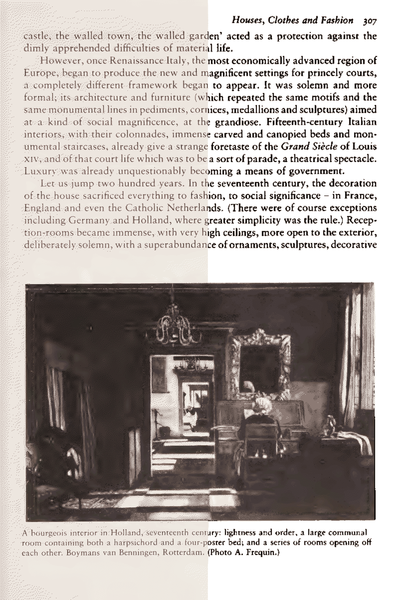

<div align="center">
  
  
</div>

# Lege - 1.4.5
Releases are updated with every new version --> https://github.com/LegeApp/Lege/releases/

Lege is a document-processing program (CLI + desktop GUI) that converts scanned documents into reader-optimized **PDF** or **DjVu**, focusing on **better readability**, **smaller output size**, and **fast page turns** on e-ink devices. It uses optional layout-aware processing to detect image areas so that they can be excluded from the text binarization process, which makes the original scanned documents readable on e-ink readers with small file size.

There are 2 generally intended usages for the program; outputs of commercial book scanning utilities such as image folders of JPEG or PNG, and outputs of the Internet Archive in either PDF or JP2 zip or image folder, since the Internet Archive is the largest digital repository of scanned digital books and documents. If there is something old you want to read on e-ink, it is probably on Archive.org but it has yellowed aged page scans and the size of the book is 500MB. Lege is for those files. Further information is in the in-program documentation file.

---

## Interfaces

* **CLI**: guided interactive mode (no args) + direct command modes
* **GUI**: Freya desktop app using the same processing core; queue-based workflow with progress + cancel

---

## Quick start

### Build (from source)

```bash
git clone https://github.com/LegeApp/Lege.git
cd Lege
cargo build --release
```

#### Linux dependencies

On Linux, you need to install the following system dependencies:

```bash
sudo apt-get install tesseract-ocr libtesseract-dev libleptonica-dev
```

You'll get:

* CLI: `target/release/lege`
* GUI: `target/release/lege-gui`

#### Sheet-music edition

Build the optimized sheet-music CLI and GUI together with the workspace shortcut:

```bash
cargo music-sheet
```

For a faster compile-only validation, run `cargo music-sheet-check`. Both shortcuts
disable the normal default features and enable only the `music-sheet` feature set.
The resulting edition does not compile `lege-ocr`, the EPUB builder, either OCR
backend, or layout detection (and it does not embed the layout model). The release
artifacts go under `target/music-sheet/release/`, separate from the full edition,
so building this edition cannot replace `target/release/lege` with a layout-free
worker.

### Linux release packaging

Lege has first-pass `.deb` and AppImage packaging metadata. The layout,
PaddleOCR, and heavy Sauvola models are embedded in the executables, so no
external model staging directory is needed:

```bash
cargo appimage
```

`cargo appimage` needs `appimagetool` on your `PATH`. It is not in the Debian/
Ubuntu repositories; download the official AppImage from
[AppImageKit releases](https://github.com/AppImage/AppImageKit/releases),
`chmod +x` it, and either place it on your `PATH` as `appimagetool` or point at
it with `APPIMAGETOOL=/path/to/appimagetool cargo appimage`. You can also build
a `.deb` with `cargo deb`.

See `docs/linux-packaging.md` for the full flow and the real-GPU OCR release
gate.

### Run

```bash
# simplest: optimized PDF output
lege input.pdf

# DjVu output (optionally with OCR)
lege input.pdf --output-format djvu --ocr

# process a page range
lege input.pdf --pages 10-50
```

the CLI also supports an interactive guided mode when run without arguments.

---

## Inputs and outputs

### Inputs

* **PDF files** (with optional page range selection)
* **Image-folder mode** for sequential page images (used for batch/page-image workflows)
* Debug modes for exporting rendered pages / crops (useful for model and pipeline inspection)

### Outputs

* **PDF**: mixed region encoding (compressed bi-level text + preserved image regions as overlays)
* **DjVu**: native Rust encoder with **JB2** (bi-level) + **IW44** (continuous-tone) layering

---

### External Dependencies

The default layout, PaddleOCR, and heavy neural binarization models are
embedded. Runtime model files are optional development overrides.

**Platform data:**

- Tesseract language data (system installation, where that backend is enabled)

> PaddleOCR, layout detection, and page rotation run through the native
> **WebGPU** backend built into Lege. PaddleOCR and layout models are embedded;
> no external OCR program or model is required.

---

# Technical details

## High-level pipeline

Lege is an end-to-end document transformation system with distinct pipelines for PDF and DjVu output.

### Core stages

1. **Render pages** (PDF → images) using Lege's integrated Rust renderer.
2. **Layout inference** (optional): run an ONNX layout model at GPU speed via the native wgpu compute runtime; map detections into text-like vs image-like buckets.
3. **Region processing**

   * Text regions: binarize + encode with bi-level codecs (JBIG2 or CCITT4)
   * Image regions: preserve/encode separately; composite as overlays where applicable
   * Optional heavy neural binarization (Sauvola model on CPU) for degraded pages
   * Optional OCR integration at region or page level
4. **Assemble output**

   * PDF writer actor: ordered page finalize into a single PDF
   * DjVu writer actor: out-of-order page submission + multipage finalize

## PDF pipeline vs DjVu pipeline

### PDF pipeline (`pipeline/pdf_tokio_pipeline.rs`)

Implemented as a multi-stage async pipeline with bounded channels and configurable concurrency:

* render → inference → CPU page processing → ordered writer/finalizer
* supports page ranges and optional two-pass margin normalization

### DjVu pipeline (`pipeline/djvu_pipeline.rs`)

Separate pipeline to match DjVu constraints:

* similar render/inference conceptually
* produces DjVu page payloads submitted to a DjVu writer actor
* supports layered JB2/IW44 output, and optional hidden text

## GPU inference — native wgpu runtime

All AI model inference (layout detection and page rotation) runs through a **native WebGPU/wgpu compute runtime** compiled into Lege. ONNX models are parsed and lowered to WGSL compute shaders at startup; compiled kernel pipelines are cached per model resolution and reused across pages.

- **Windows**: DX12 backend via wgpu
- **Linux**: Vulkan backend via wgpu
- **macOS**: Metal backend via wgpu

No external inference runtime (ONNX Runtime, DirectML, etc.) is required. The
GPU runtime lives in the ecosystem-level `lege-gpu` crate
(`../lege-gpu/src/vision/`).

## Layout detection

Lege can run GPU-accelerated layout detection to segment a page into regions and apply different encoding strategies. When layout detection is disabled, Lege follows a uniform whole-page processing strategy.

## Binarization and image treatment

* **Text-like regions** are typically converted to **1-bit** (bi-level) using adaptive binarization logic in the encoding layer.
* **Image-like regions** can be preserved/encoded separately and overlaid onto the output (so photos/diagrams don't get crushed into 1-bit).
* **Heavy neural binarization** (optional): the Sauvola ONNX model runs on CPU with global instance-normalization statistics, giving high quality results on degraded or difficult pages without GPU tiling artifacts.

## OCR and text layers

OCR is optional:

* **Linux/macOS**: Tesseract (in-process via the `tesseract` Rust crate)
* **Windows**: WinRT OCR

Strategy:

* prefer bounded region OCR when layout segmentation is workable
* fall back to tiled or full-page OCR as needed
* when OCR is disabled, Lege can optionally reuse/extract text from PDFs that already have a text layer to synthesize a text overlay where possible

## Encoding formats and where they're used

Lege keeps its in-memory encoding and color-processing modules in the process
crate. The JBIG2 and JPEG2000 implementations live under
`../lege-codecs/{jbig2enc-rust,jp2lam}` and are patched into the root ecosystem
workspace. The native DjVu encoder remains a separate executable under
`../lege-codecs/djvulibrust`.

### Bi-level / "text compression" codecs

* **JBIG2** (via the `jbig2enc-rust` dependency)
* **CCITT Group 4** (fax-style bi-level compression)

### Continuous-tone codecs

* **JPEG2000** (used for cover/photo regions in common paths)
* **DjVu IW44** (continuous-tone layer inside DjVu)

## Performance and operability features

* **Concurrent pipeline** with bounded channels/backpressure and adaptive per-job concurrency
* **Resident compiled GPU graphs**: model kernels are compiled once at startup and reused across all pages — no per-page GPU recompilation
* **Cancellation + progress tracking** shared by CLI and GUI
* Runtime dependency discovery (models/libs) via executable-adjacent paths, env vars, and platform fallback dirs

---

## Workspace layout

Lege Process is one application family inside the ecosystem workspace rooted at
`../Cargo.toml`:

* `core/` — Rust library/binary roots plus general process services
* `pipeline/` — PDF, DjVu, EPUB/reflow pipeline orchestration
* `encoding/`, `color/`, `colorquant/`, `resize/` — image treatment and codec adapters
* `ocr/`, `reflow/` — process-level OCR/reflow integration
* `models/`, `language_service/` — process runtime/embedded data
* `lege-ipc/` — IPC and shared log types for the CLI and GUIs
* `GUI/Freya/` — desktop GUI frontend
* `GUI/musicsheet/` — Sheet Music Edition frontend

Shared ecosystem crates are siblings of this folder: `../lege-gpu`,
`../lege-ocr`, and `../lege-pdf/write`. Codecs live in `../lege-codecs`, shared
assets/tools live in `../lege-misc`, and the future renderer has its assigned
location at `../lege-pdf/render`.

---

## License

AGPL-3.0. See `LICENSE`. Third-party licenses are documented under `docs/`.

---
